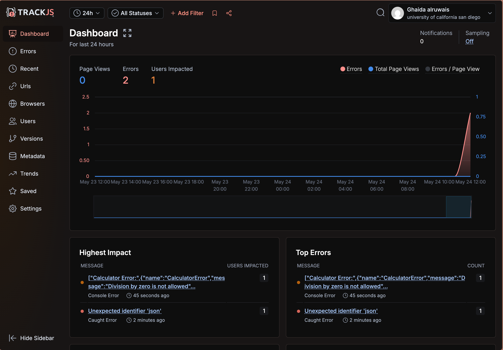

# JavaScript Error Handling Lab

This lab demonstrates various JavaScript error handling techniques and console methods. The application includes a calculator with error handling and multiple buttons to showcase different console functionalities.

## Features

1. **Calculator with Error Handling**
   - Input validation
   - Custom error messages
   - Try/catch/finally implementation
   - Safe calculation without eval()

2. **Console Method Demonstrations**
   - console.log
   - console.error
   - console.count
   - console.warn
   - console.assert
   - console.clear
   - console.dir
   - console.dirxml
   - console.group/groupEnd
   - console.table
   - console.time/timeEnd
   - console.trace

3. **Global Error Handling**
   - Implementation of window.onerror
   - Custom error class (CalculatorError)

## Running the Project

1. Clone this repository
2. Open index.html in a modern web browser
3. Open the browser's developer tools (F12 or right-click -> Inspect)
4. Try out the calculator and different console method buttons
5. Observe the output in the console

## Error Handling Examples

1. Try entering non-numeric values in the calculator
2. Try dividing by zero
3. Leave input fields empty
4. Click the "Trigger a Global Error" button to see global error handling

## Notes

- Make sure to have the browser's developer console open to see the output of various console methods
- The calculator implements proper error handling and validation
- Custom error types are used to provide more specific error information

## Link
[GitHub Pages](https://ghaidaalruwais.github.io/Lab9_Starter-GhaidaAlruwais/)

## screenshot of dash board

